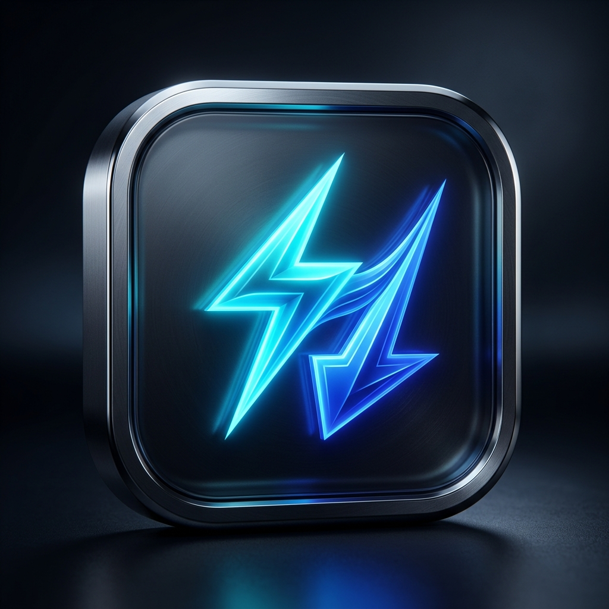
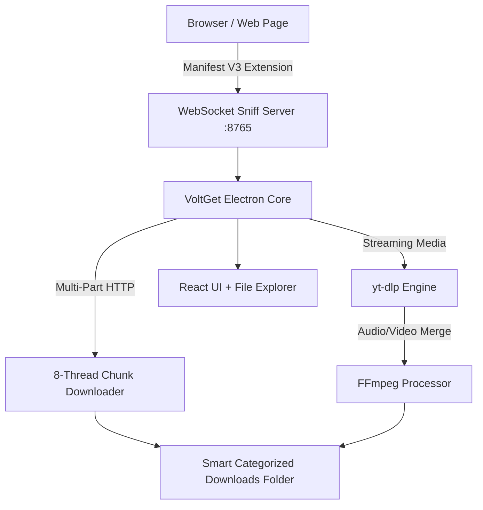

<p align="center">
  
</p>

<h1 align="center">⚡ VoltGet</h1>

<p align="center">
  <b>Next-Generation High-Speed Download Manager & Smart Media Sniffer</b><br/>
  <i>Ultra-fast multi-part downloads, intelligent HLS/m3u8 stream grabber, and modern IDM alternative for the web.</i>
</p>

<p align="center">
  <a href="https://github.com/eekilinc/VoltGet/releases"></a>
  <a href="https://github.com/eekilinc/VoltGet/blob/main/LICENSE"></a>
  <a href="https://www.electronjs.org/"></a>
  <a href="https://www.typescriptlang.org/"></a>
  <a href="https://vitejs.dev/"></a>
  <a href="https://github.com/yt-dlp/yt-dlp"></a>
</p>

---

## 🌟 Overview

**VoltGet** is a powerful, modern, open-source download manager designed to replace legacy tools like Internet Download Manager (IDM). It integrates an **8-threaded accelerated multi-part HTTP engine**, a **deep network sniffer**, and **yt-dlp + FFmpeg** integration to download files, videos, and music at peak network speeds.

Equipped with a Chromium browser extension (Manifest V3), VoltGet automatically detects media streams, floating download buttons over HTML5 video players, and captures browser download requests with a seamless IDM-like instant dialog.

---

## ✨ Key Features

<table>
  <tr>
    <td width="50%">
      <h3>🚀 8-Thread Multi-Part Acceleration</h3>
      Splits large files (ZIP, ISO, EXE, MKV, etc.) into 8 concurrent HTTP byte-range chunks. Downloads finish up to 500% faster with seamless pause, resume, and file reassembly.
    </td>
    <td width="50%">
      <h3>🎯 1800+ Media Sites & 4K Video</h3>
      Powered by <code>yt-dlp</code> and <code>FFmpeg</code>. Download video & audio from YouTube (up to 4K/8K 60fps), TikTok, Instagram, Twitter/X, Reddit, Vimeo, Facebook, and more.
    </td>
  </tr>
  <tr>
    <td width="50%">
      <h3>🎬 Intelligent HLS & DASH Auto-Merger</h3>
      Automatically parses <code>master.m3u8</code>, <code>master.txt</code>, and <code>manifest.mpd</code> playlists. Intelligently matches and merges separate audio and video streams into crystal-clear MP4 files.
    </td>
    <td width="50%">
      <h3>🎵 One-Click MP3 Audio Extractor</h3>
      Extract high-bitrate MP3 audio directly from any video stream or web link with metadata preservation.
    </td>
  </tr>
  <tr>
    <td width="50%">
      <h3>🧩 IDM-Style Browser Extension</h3>
      Manifest V3 extension injects a sleek floating "Download Video" badge directly above web media players and auto-intercepts browser downloads via WebSocket.
    </td>
    <td width="50%">
      <h3>📁 Integrated File Explorer</h3>
      Manage your downloads directly in-app. Automatic category sorting (Videos, Audio, Documents, Archives, Software) with open folder, rename, and launch controls.
    </td>
  </tr>
  <tr>
    <td width="50%">
      <h3>🎛️ PRO IDM Download Dialog</h3>
      Instant capture modal with editable filename, auto-category badges (Video, Music, Archive, Document), live disk free space indicator, resolution quick-pills (4K/1080p/720p/MP3), and dual action buttons (Download Now vs Add to Queue).
    </td>
    <td width="50%">
      <h3>📋 Clipboard Watcher & Drag-and-Drop</h3>
      Non-intrusive clipboard listener catches copied media URLs with a 1-click floating action. Drag & drop URLs directly onto the app, or extract dozens of links simultaneously using the Batch Harvester.
    </td>
  </tr>
  <tr>
    <td width="50%">
      <h3>🌍 6 Languages (i18n)</h3>
      Full native localization for <b>English, Türkçe, Deutsch, Español, Русский, and العربية</b>.
    </td>
    <td width="50%">
      <h3>🎨 Modern Glassmorphic UI & 7 Themes</h3>
      Clean, responsive dark-mode interface with live network speed meters and customizable accent colors: Blue, Purple, Green, Orange, Pink, Red, and Teal.
    </td>
  </tr>
</table>

---

## 🏗️ Architecture

VoltGet combines high-performance native binaries and modern web technologies:



- **Renderer**: React 18 + TypeScript + Vite + Tailwind/Glassmorphic Vanilla CSS.
- **Core / Main**: Electron 31 + Node.js Child Processes + WebSockets.
- **Engines**: `yt-dlp` (stream extraction) + `FFmpeg 6/7/8/9` (multiplexing & conversion).
- **Extension**: Chromium Manifest V3 (`webRequest` + Content Script + WebSocket client).

---

## 🚀 Getting Started

### Prerequisites

1. **Node.js**: v20 or newer ([nodejs.org](https://nodejs.org/))
2. **FFmpeg**: Installed and accessible in PATH or WinGet ([ffmpeg.org](https://ffmpeg.org/))
   - *Windows WinGet*: `winget install Gyan.FFmpeg`
3. **yt-dlp**: VoltGet includes an in-app updater that automatically fetches the latest `yt-dlp.exe` to `bin/yt-dlp.exe`.

### Installation

```bash
# 1. Clone the repository
git clone https://github.com/eekilinc/VoltGet.git

# 2. Enter project directory
cd VoltGet

# 3. Install dependencies
npm install

# 4. Start in development mode
npm run dev
```

### Production Build

```bash
# Build desktop executable (Windows NSIS & Portable)
npm run build
```
Output binaries will be generated inside the `release/` directory.

---

## 🧩 Browser Extension Setup

To enable IDM-style automatic video sniffing and floating download badges:

1. Open your Chromium browser (**Google Chrome**, **Microsoft Edge**, **Brave**, or **Opera**).
2. Navigate to `chrome://extensions/` (or `edge://extensions/`).
3. Toggle on **Developer mode** in the top-right corner.
4. Click **Load unpacked** (*Paketlenmemiş öğe yükle*).
5. Select the `extension/` folder inside this repository:
   ```
   D:\Denemeler\flexplorer\extension
   ```
6. Open any video website (e.g. YouTube, news site, or movie streaming platform). A sleek **⚡ VoltGet ile İndir** button will appear on the video player!

---

## ⚙️ Settings & Configuration

VoltGet provides customizable settings stored locally in your app profile:

- **Concurrent Downloads**: Set maximum simultaneous active downloads (1 - 10).
- **Speed Limiter**: Cap global download speed (KB/s) to save bandwidth for gaming or streaming.
- **Site Folders**: Automatically group downloads into subfolders by domain name (e.g., `Downloads/VoltGet/youtube.com/`).
- **File Name Template**: Custom naming schemes (e.g., `%(title)s.%(ext)s`).
- **Auto-Start & Tray**: Launch on system startup and minimize to system notification tray.
- **Accent Theme**: Choose between Blue, Purple, Green, Orange, Pink, Red, or Teal.

---

## 🤝 Contributing

Contributions, issues, and feature requests are welcome!
Feel free to check the [issues page](https://github.com/eekilinc/VoltGet/issues).

1. Fork the Project
2. Create your Feature Branch (`git checkout -b feature/AmazingFeature`)
3. Commit your Changes (`git commit -m 'feat: add some amazing feature'`)
4. Push to the Branch (`git push origin feature/AmazingFeature`)
5. Open a Pull Request

---

## 📄 License

Distributed under the **MIT License**. See [`LICENSE`](LICENSE) for more information.

---

<p align="center">
  Made with ⚡ by <a href="https://github.com/eekilinc">eekilinc</a>
</p>
